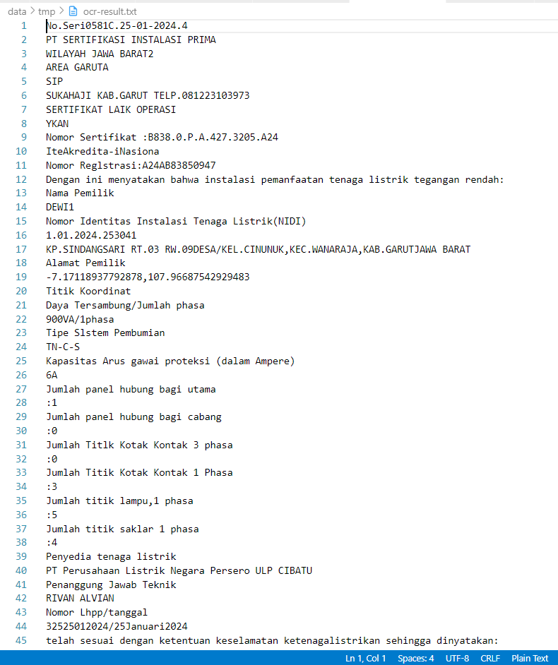

# Document Verification

Document Verification is the implementation of the program described in the paper "One-shot Verification of Paper Certificates with Robust Preprocessing." This program consists of several processing stages: preprocessing, text extraction, QR extraction, and verification. Due to certain limitations, our implementation does not include storage on the blockchain. Therefore, during verification, the program is assumed to have already received the original value (pattern). The output of the program is the validity status of the certificate.

# Dependencies

1. This program runs on Python 3.9.10.
2. For the OCR engine, we use Paddle OCR (PPOCR V4).
3. The segmentation process uses YOLOv8.
4. The QR extraction process uses PyBoof (Python library).

# How to Run the Program

1. Clone this repository:

    ```bash
    git clone https://github.com/rifchzschki/Document-verification
    ```

2. Install all dependencies:

    ```bash
    cd Document-verification
    pip install -r requirements.txt
    ```

3. Create an `input` folder in `data` to store your captured images:

    ```bash
    mkdir data/input
    ```

4. Create `output` and `output_segmentation` folders in `data` to view the segmentation results:

    ```bash
    cd data
    mkdir output
    mkdir output_segmentation
    ```

5. Create a `txtTruth` folder to store the ground truth values for each field in the certificate:

    ```bash
    mkdir txtTruth
    ```

6. Create a `tmp` folder to store your temporary files; all processing will be stored there:

    ```bash
    mkdir tmp
    ```

7. Store input images in the `input` folder and ground truth values in `txtTruth`.
8. Run this command in your CLI:

    ```bash
    cd src
    python main.py --image_name {your-image} --invers {y/n} --output {temp txt for OCR result} --target {ground-truth-txt} --prep {y/n} --ocr {y/n} --verif {y/n}
    ```

9. See the results in `tmp/hasil.txt`.
10. All processes will be stored in the `tmp` folder; you can change the scheme if you want.

# Example
### Captured Image
> First, place your captured image into the `input` folder.


### Segmented Image
> The program will segment your certificate.


### Cropped Image
> After segmentation, the segmented area will be cropped, and this process will correct the perspective of the certificate.


### Preprocessed Image
> The cropped image will undergo image enhancement and auto-rotation to correct the text direction in the certificate.


### OCR Result
> The text extraction process will extract each text element in the certificate.


### QR Result
> Unfortunately, our program is still not robust in this process. For QR detection, we must ensure that the image provided is very clear, especially the QR code section. In this case, we used another image that was clearer but from the same certificate.


### Ground Truth Text
> This value would be stored in the database or blockchain. For experimental purposes, we assumed the text is stored as a `.txt` file.


### Result
> The verification process will display the result as the validity status of the image.


# Authors

1. Muhamad Rifki Virziadeili Harisman
2. Maulvi Ziadinda Maulana
3. Raditya Aditama
